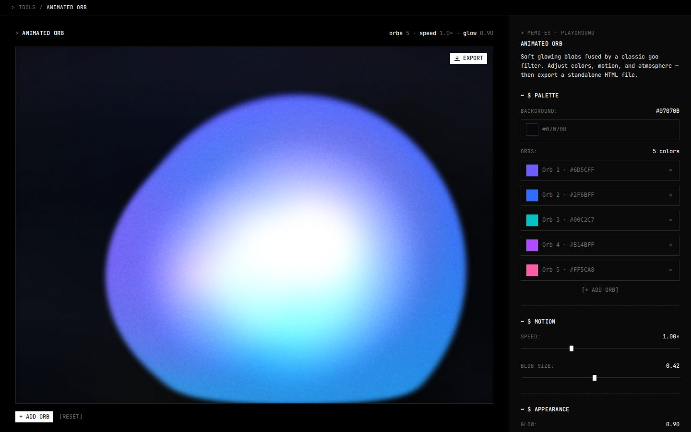

# Animated orb

A background of soft coloured blobs that drift, breathe and run into each other, and you can tune the colours, the motion and the atmosphere and export the result as a single HTML file. I rebuilt it from the orb on ElevenLabs.

Live at [tools.memoesparza.com/animated-orb](https://tools.memoesparza.com/animated-orb/).

## Usage

Open the page, set it up in the panel and hit **Export**, which downloads `animated-orb.html` with your settings in it. That file has no dependencies, so it can go anywhere a page can go, and you can drop it into another site as an iframe or a background.

To work on it, open `index.html` in a browser. There is no build step.

## How it works

The blobs are drawn on a `<canvas>` and passed through an SVG filter, which is where the look comes from:

1. A Gaussian blur softens each blob.
2. An alpha threshold makes the blurred edges hard again, so blobs that overlap fuse into one shape (the usual goo filter).
3. A flood and a composite cut that shape out as a matte.
4. The blobs' own colours are painted back inside the matte.
5. A last blur softens it all into a glow.

A grain texture and a tinted overlay sit on top. The size, speed and path of each blob are randomised on every load.
