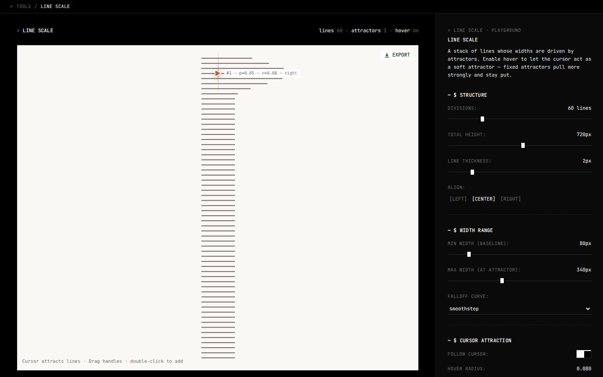

# Line scale

A stack of horizontal lines whose widths swell around points you place, and around the cursor if you want. You drag the points (attractors) on the canvas, shape how fast the swell falls off, and export what you get.

Live at [tools.memoesparza.com/animated-scale](https://tools.memoesparza.com/animated-scale/).

## Usage

Open `index.html` in a browser, there is no build step. The panel has:

| Section | |
| --- | --- |
| Structure | how many lines, the total height, the line thickness and whether the lines grow from the left, the centre or the right |
| Width range | the width of a line far from everything and its width at an attractor |
| Attractors | add, move and remove them, each with its own radius, strength and shape, and the falloff curve they share |
| Cursor attraction | whether the cursor pulls too, how strongly, how far and on which side |
| Color | the line and the background |

**Export** saves a PNG or JPG, an SVG, or the settings as JSON.

## How it works

Each line's width is the baseline plus the pull of every attractor within reach, eased through the falloff curve, and the whole stack is drawn as one SVG. The same function builds the SVG on screen and the one you export, so the file is exactly what you were looking at.

The page is React, loaded with Babel from unpkg, so it needs that CDN to be reachable.
