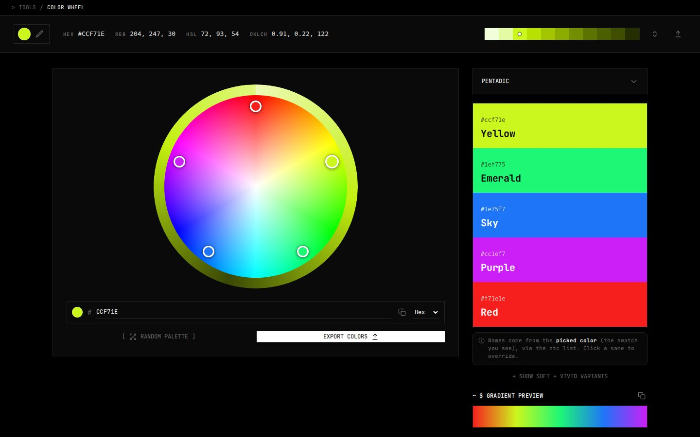

# Color wheel

A colour wheel for building palettes. You pick a base colour, choose a harmony and drag its handles around the wheel, and every colour gets a name, a Tailwind style 50 to 950 scale and a contrast check, and the palette exports as code or as a board.

Live at [tools.memoesparza.com/color-wheel](https://tools.memoesparza.com/color-wheel/).

## Usage

Open `index.html` in a browser, there is no build step.

- The top bar shows the current colour in Hex, RGB, HSL and OKLCH, with a picker and, in Chrome and Edge, an eyedropper.
- The harmonies are analogous, complementary, split and double split complementary, triadic, rectangle, tetradic, square and pentadic. Tetradic can take a fifth colour, which goes into the widest gap in hue, for a five stop gradient you can copy as a CSS `linear-gradient`.
- Each swatch has a name you can click to rename, a soft and a vivid variant, and a detail view with its full scale, a WCAG contrast grid and its values in every format. Clicking a stop in that scale moves the base colour to that stop and rebuilds the ramp around it.
- **Random palette** starts over from a random base.
- Export writes CSS, SCSS, JSON, a Tailwind config, an SVG, a hex array or a brand board, and the wheel itself as SVG or PNG on a transparent background. Names and variants go into every code export.

## How it works

The names come from the Name That Color list through [api.color.pizza](https://api.color.pizza), the same list uicolors.app uses, and each name is used once per palette. Without a connection it falls back to a name made from the hue.

The scales are worked out in OKLCH, on lightness and chroma curves averaged from Tailwind's own palettes, so a bright colour lands on 400 rather than 500, the middle stays saturated and the dark end gets deeper. A colour that falls outside sRGB has its chroma brought down until it fits rather than being clipped. None of this needs a key or a network.

## Limits

- The eyedropper only exists in Chromium browsers.
- Names need api.color.pizza to be reachable, and the fallback names are much plainer.
