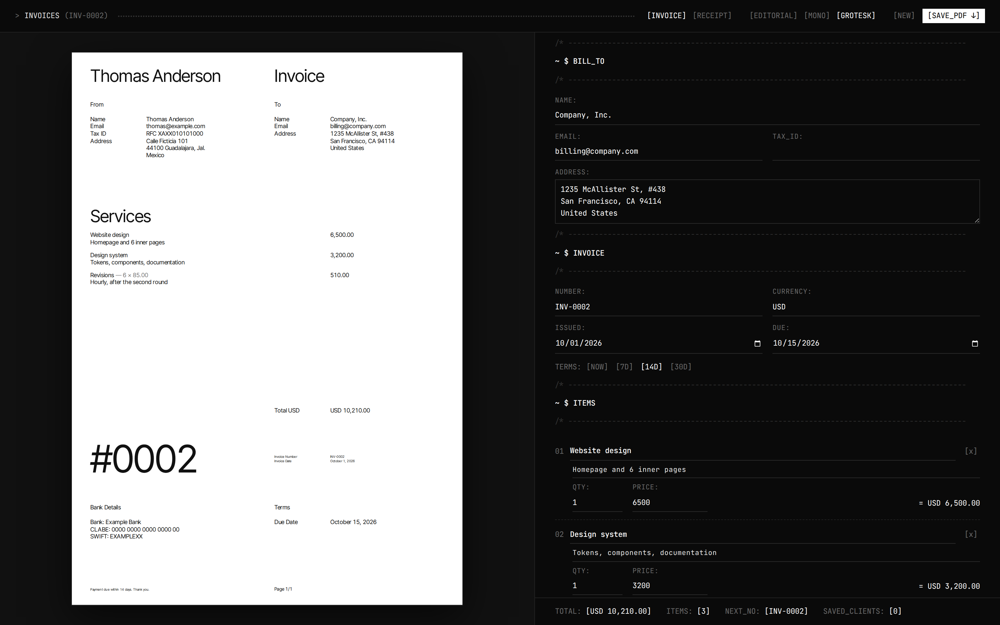

# invoices

A small web app for making invoices and receipts for clients and collaborators. Fill in the form on the right, watch the page update on the left, save it as a PDF.



## Why

I was making invoices by duplicating an old file and fixing the numbers by hand. This keeps my details, my clients and the next invoice number in one place, so a new invoice is a client name and a couple of line items.

## Usage

```sh
npm install
npm run dev
```

Open http://localhost:5173.

1. Fill in **FROM** once: name, address, tax ID, bank details. It's saved for every invoice.
2. Type a client under **BILL_TO**. Clients you've invoiced before show up as suggestions.
3. Add items, pick a currency, and add a tax rate if the invoice needs one (leave it empty for none).
4. Pick a template in the top bar: Editorial, Mono or Grotesk.
5. Hit **SAVE_PDF** and choose "Save as PDF" in the print dialog. The file is named after the invoice number and client.

**NEW** starts a blank invoice with the next number and keeps your currency, tax and notes.

### Receipts

Switch the top bar from **INVOICE** to **RECEIPT** for a signed proof of payment, in Spanish (**ES**) or English (**EN**).

- **I_AM** says which side you're on. **RECEIVING**: a client paid you, and you sign. **PAYING**: you paid someone, like rent to a landlord, and they sign. Your saved **FROM** details go on your side; the person goes on the other.
- **POR_CONCEPTO_DE** (or **FOR**) finishes the sentence the receipt is built around: *Recibí de … la cantidad de … por concepto de …*. Leave it empty and the item names are used.
- **PAID_IN** is the payment method: efectivo, transferencia, cheque, or anything you type.
- **PLACE** and **DATE** print as *Guadalajara, Jal., a 2 de octubre de 2026*.
- **TITLE** replaces the heading, e.g. *Recibo de arrendamiento*.

The total is written out in words, the way Mexican receipts do: *CIENTO NOVENTA Y CUATRO MIL QUINIENTOS OCHO PESOS 00/100 M.N.* Receipts are numbered separately from invoices (`REC-0001`), and **NEW** keeps the receipt details, so next month's rent is a date change.

Open `/?demo=mono` (or `editorial`, `grotesk`, `receipt`) in dev to load sample data. This replaces the current draft.

## How it works

- Vite, React and TypeScript, no backend. `npm run build` makes a static site in `dist/` that can go on any static host.
- Colours and fonts come from [tools-design-system](https://github.com/Memo-Es/tools-design-system), installed from GitHub, so a change there reaches this app after `npm update tools-design-system`.
- Everything is stored in the browser's localStorage (`src/lib/store.ts`). Clearing site data wipes your details and clients.
- The PDF is the browser's own print output, so text stays selectable. Templates are A4 and sized in millimetres (`src/paper.css`).
- The invoice number advances the first time you save a PDF with the current number. Saving the same invoice again doesn't skip a number.

## Limits

- One page per invoice. Long item lists will get cut off.
- Invoices aren't kept after you start a new one. Keep the PDFs.
- Invoice labels are in English. Receipts can be Spanish or English.
- A receipt is not a CFDI. If the payment needs to be deducted with SAT, the person who received it has to issue one.
- Data lives in one browser on one machine.
