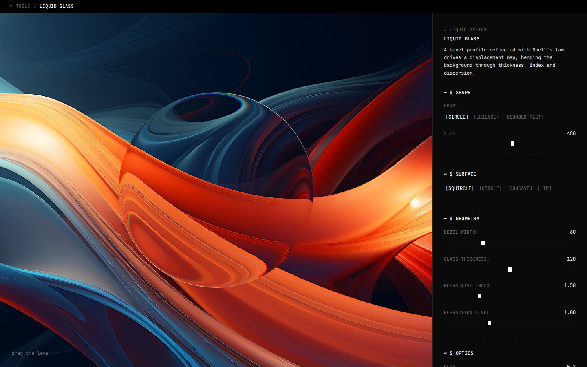

# Liquid glass

A glass lens that bends whatever is behind it, made with SVG filters and nothing else. You can drag the lens around and change its shape, the profile of its edge, how thick the glass is and how strongly it refracts.

Live at [tools.memoesparza.com/liquid-glass](https://tools.memoesparza.com/liquid-glass/).

## Usage

Open `index.html` in a browser, there is no build step. The panel covers the shape and size of the lens, the surface profile, bezel width, glass thickness, refractive index, refraction level, blur, chromatic aberration, saturation, the strength of the highlight on the rim and the background image.

## How it works

`demo-utils.js` works out a displacement map by refracting light through the profile of the bezel with Snell's law, and a second map for the light on the rim. An SVG filter brings in the background with `feImage`, displaces it three times at slightly different scales so each colour channel bends a little differently, puts the channels back together, lays the rim light on top and cuts the result to the shape of the lens.

Two settings make it render nothing at all if they are wrong, without an error:

- `color-interpolation-filters="sRGB"`. SVG filters work in linearRGB by default, which shifts the values of a map whose channels are geometry rather than colour.
- `dpr` has to be 2 or more. The rim light is `sqrt(1 - (1 - depth/dpr)²)`, and at `dpr: 1` anything deeper than a pixel goes negative and the rim comes back as `NaN`.

## Limits

- It refracts an image, not the page. `backdrop-filter: url(#…)` can bend live DOM too, but it only has what is already painted behind it to work with, so a soft displacement over flat colour doesn't show.

## Credit

`demo-utils.js` is unmodified from [jeantimex/glass-ui](https://github.com/jeantimex/glass-ui), which is MIT licensed, and the filter follows its `morphing` demo.
