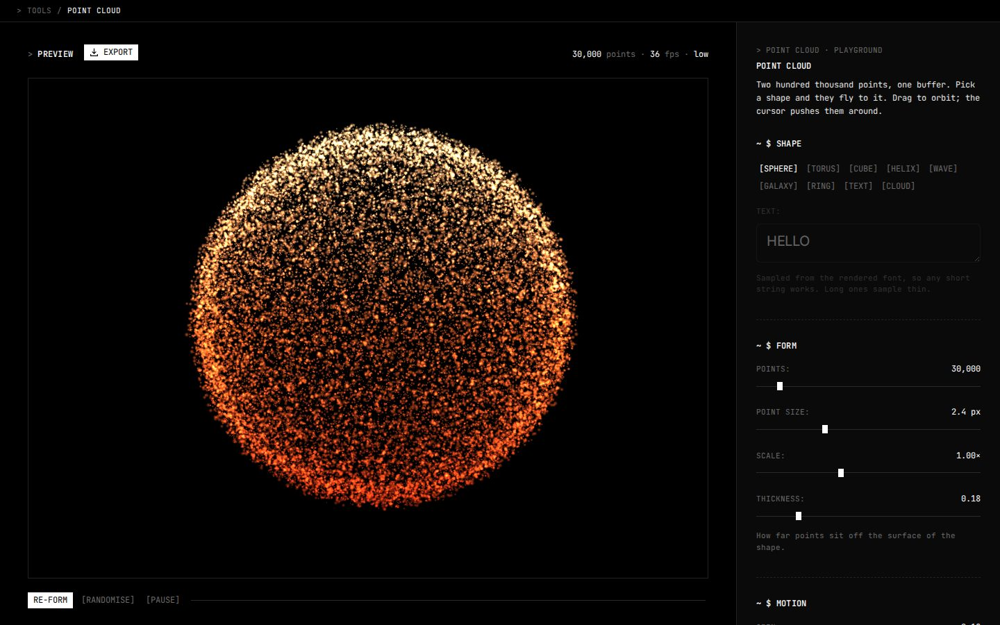

# Point cloud

A WebGL cloud of up to 220,000 points that gathers into a shape you pick: sphere, torus, cube, helix, wave, galaxy, ring, cloud, or your own text sampled from the rendered font. You drag to orbit it and the cursor pushes the points around.



Live at [tools.memoesparza.com/point-cloud](https://tools.memoesparza.com/point-cloud/), and the second playground in here at [/point-cloud/editions](https://tools.memoesparza.com/point-cloud/editions/).

## Usage

It has to be served over HTTP, because ES modules don't load from `file://`:

```sh
npx serve point-cloud
```

There is no build step and nothing to install. three.js comes from jsDelivr.

| Section | |
| --- | --- |
| Shape | which shape the points gather into, and the text when the shape is Text |
| Form | point count, point size, overall scale and how far points sit off the surface |
| Motion | spin, drift, how long a change takes, how far points fly out on the way and how much they trail |
| Interaction | how hard the cursor pushes and how far it reaches |
| Colour | six palettes or three stops of your own, what the gradient follows, and glow |

**Re-form** replays the current shape, **Randomise** picks a new shape, palette and gradient, and **Export** saves a PNG or JPG of the stage or copies the settings. From the console you can reach everything through `PCH`, for example `PCH.state.scatter = 9; PCH.apply()`.

`editions/` is a second playground: an abstract cloud that turns into a shape or your text on one trigger, inside a rotating band of type you can size and tilt. It has its own copy of every module and imports nothing from the first one, so changing one can't break the other.

## How it works

Every point has two positions, `position` where it is and `aPosB` where it's going, and a change of shape is one uniform going from 0 to 1. When it lands, B is copied into A and the uniform goes back to 0, so a change of shape costs one buffer upload.

On the way, points fly outward by `sin(pi * x)`, which is zero at both ends and one in the middle, so a point can go as far out as the setting asks and still land exactly on its target. Each point also starts a little later or earlier than the others, which keeps the cloud from moving as one block.

Colour is worked out in the shader from each point's final position and a three stop gradient, never stored in a buffer, so changing the palette or what the gradient follows shows up on the next frame without rebuilding anything.

With additive blending, brightness goes up with opacity times the number of points, so adding points would just make the cloud brighter. Each point shrinks by `1/sqrt(count)` instead, which keeps the exposure where it was and spends the extra points on a finer grain.

The pointer starts at the centre of the stage, so the cursor's push stays off until the pointer actually moves. Otherwise it would punch a hole through the middle of the shape before anyone touched it, and on a phone it would never go away.

The point count starts from a guess at how fast the machine is, in four tiers, and after that the slider is yours and nothing changes it.

## Files

```
index.html              the stage and the panel
src/css/playground.css  the panel's styles
src/js/
  config.js             defaults, shapes and palettes, the place to start
  shapes.js             the shape generators
  controls.js           the panel
  point-cloud.js        buffers and material
  main.js               setup and the render loop
  fluid-field.js        the smoothed cursor
  device-tier.js        the starting point count
  rng.js                seeded randomness
  shaders/              GLSL as template strings
editions/               the second playground, the same layout plus word-band.js
```

## Licence

MIT, see [LICENSE](LICENSE).
