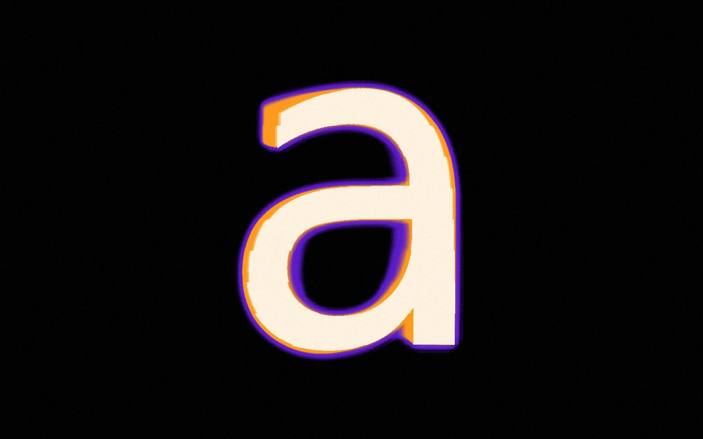

# Kinematic type

A glyph turning on its own axis, cut into horizontal bands that each run a little behind the one above, so the motion breaks into steps and leaves a heat trail that fades through four colours. The effect is after [oyeabhijit](https://www.instagram.com/oyeabhijit/)'s "[a] — Typeface".

Live at [tools.memoesparza.com/typography/kinematic](https://tools.memoesparza.com/typography/kinematic/).

## Usage

Open `index.html` in a browser, there is no build step and nothing loads from a CDN except Google fonts.

You can set how many bands there are, how far each lags and where they start (one band gives a smooth smear instead of steps), the swing or spin and its perspective, the trail's spread, glow and grain, and the palette, from five presets or four stops of your own. The font can be one of the built in ones, a Google font or a file you upload.

Press **Space** to pause and pick the frame for a still. **Export** saves a PNG or JPG at up to 4K, a WebM of whole cycles, or the settings as JSON. The whole composition is kept in the page's address, so copying the link keeps it.

## How it works

Three shader passes in WebGL2:

1. The text is drawn once into a texture. Each pixel works out which band it's in, winds the clock back by that band's delay, and undoes a rotation around the vertical axis, with perspective, to find where on the glyph it lands.
2. A feedback buffer keeps whichever is brighter, this frame's glyph or a blurred, faded copy of the last frame, which is the trail.
3. The trail's value goes through the palette (core, warm, cool, then the ground), with a glow and film grain on top.

The colour fringe is time rather than a channel offset. Where the glyph is now is the core colour, and the longer ago it was somewhere, the cooler that spot gets.
