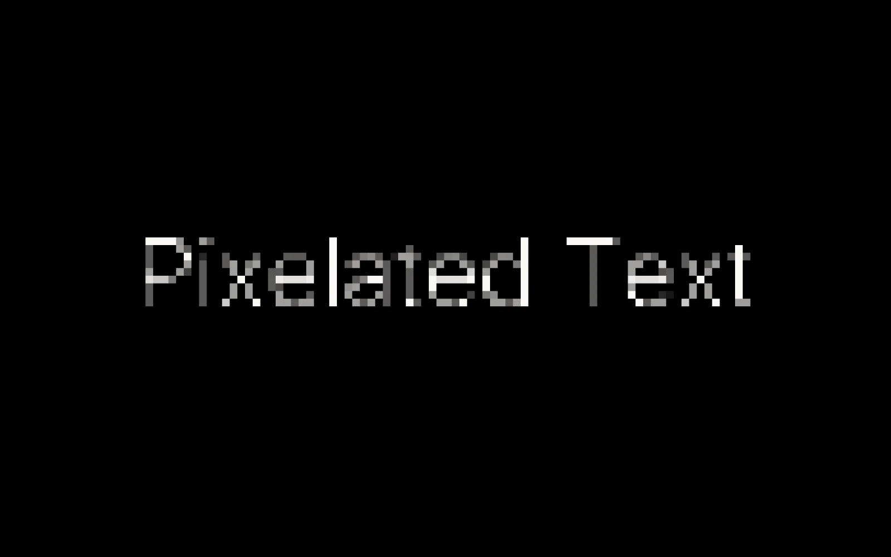

# Pixelated text

Text that comes in through a grid of blocks that keep getting smaller until the letters are sharp. You type the words, pick the font, the colours and how the blocks shrink, and export it as a still, a video, the settings or a snippet for another page.



Live at [tools.memoesparza.com/typography/pixelated-text](https://tools.memoesparza.com/typography/pixelated-text/).

## Usage

Open `index.html` in a browser, there is no build step. React and Babel load from unpkg.

The font can be Inter, the system font, a mono, Georgia, a Google font added by name, or a file you upload. **Export** has four tabs:

- **Image**, a PNG or JPG of the finished text at up to 4K.
- **Video**, a recording of the animation as WebM, or MP4 where the browser can record it.
- **Embed**, a snippet that plays the animation on any page, described below.
- **JSON**, the settings, to keep or to share.

### Embed

The Embed tab gives you a snippet with your settings in it. The script version adds a frame to the element you point it at, full width and as tall as `data-height`:

```html
<div id="pixtext"></div>
<script src="https://tools.memoesparza.com/typography/pixelated-text/embed.js"
        data-target="pixtext" data-height="300"
        data-config='{"text":"Hello World","size":140}'></script>
```

The iframe version is the same page without the script, with the settings in its address: `embed/?c=` and the JSON, URL encoded. Anything left out of the settings takes the playground's default. A font you uploaded stays on your computer, so an embed using one falls back to the next font in the stack, and Google fonts load by name.

## How it works

`engine.js` draws the text once onto a hidden canvas at full sharpness and keeps it. Each frame splits the visible canvas into square cells, samples the hidden one at the centre of each cell (and at four more points when the cells are big), and fills the cell with the average colour. The cell size shrinks exponentially from the largest block to the smallest over the duration, through the easing you picked, so the change feels even from blocky to sharp.

The playground (`index.html`) and the embed (`embed/index.html`) both load `engine.js`, so they always draw the same thing. The embed holds still on the sharp text when the reader has asked for reduced motion.

## Files

- `index.html`, the playground.
- `engine.js`, the drawing, shared by the playground and the embed.
- `embed/index.html` and `embed.js`, the embed and the script that adds it to a page.
- `project/` and `chats/`, the design files and the conversation the playground was designed in.

## Limits

- `project/fonts/` has PP Editorial New files that came with the design files. Check that their licence allows them in a public repo before relying on them.
